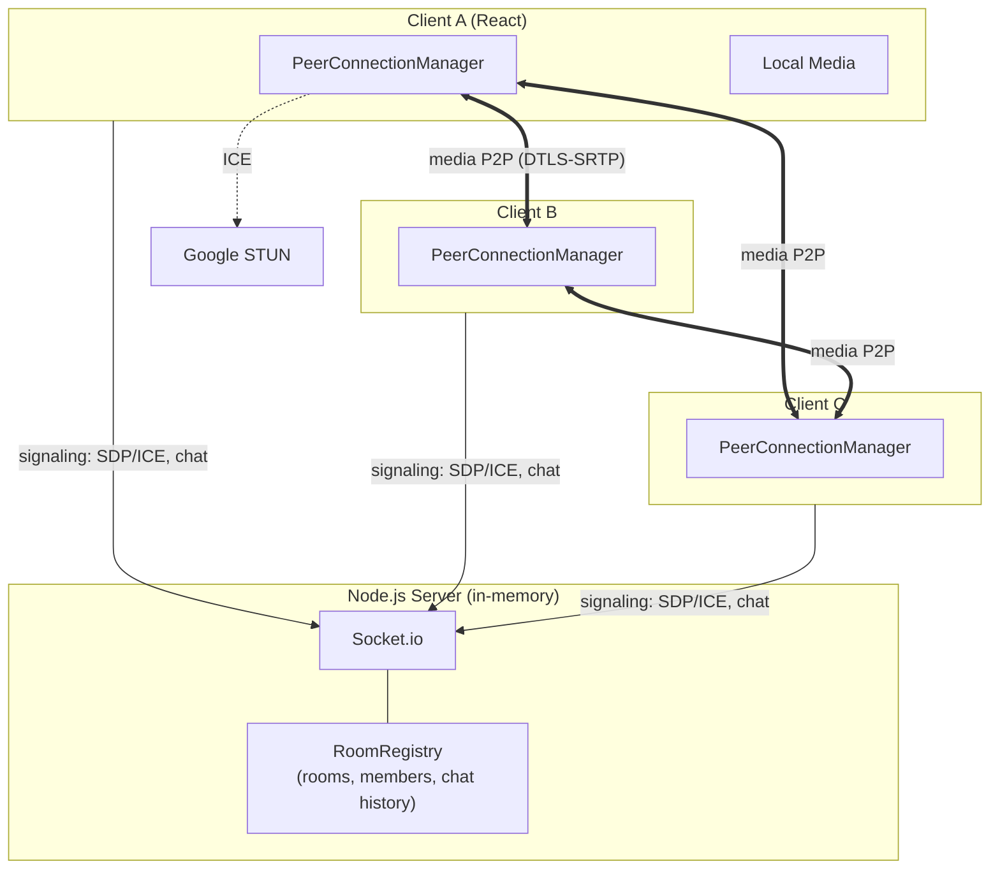
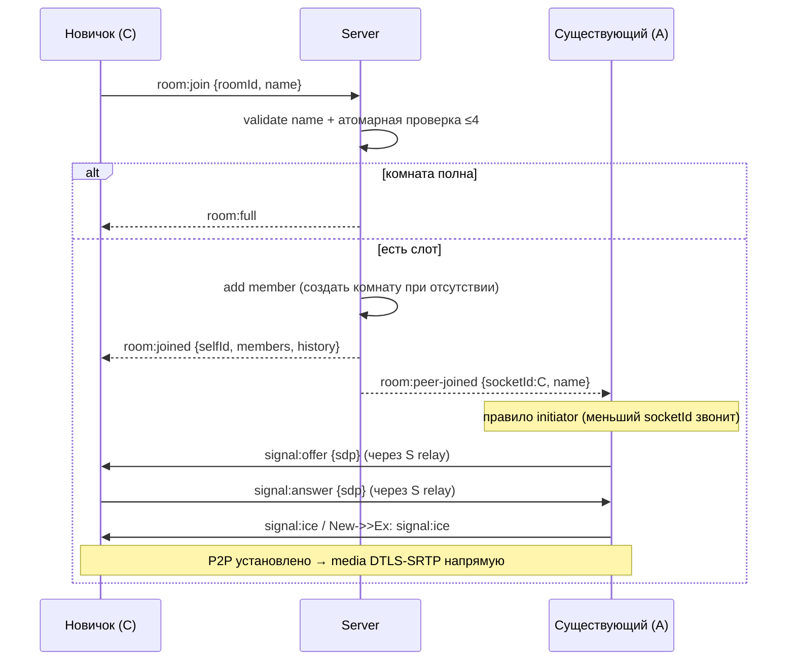
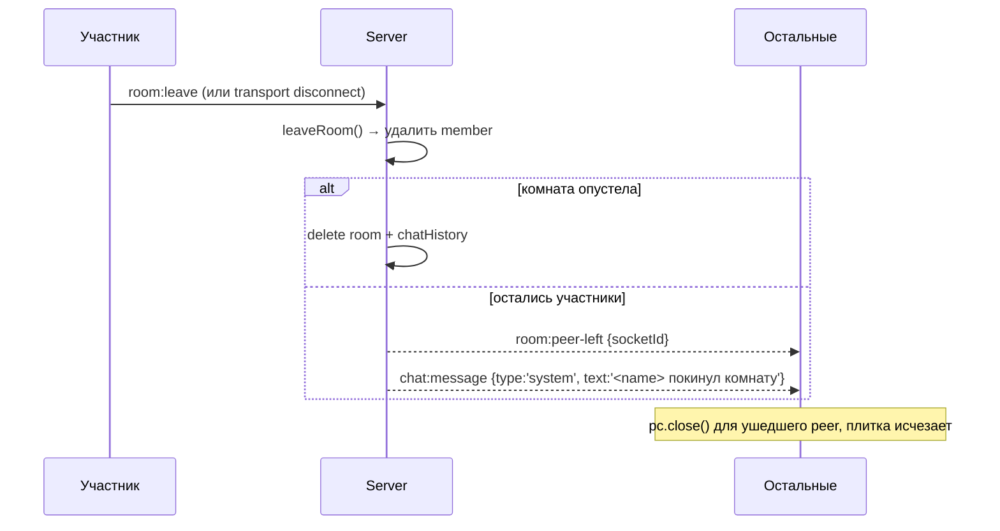

# TDD — Видеочат-комната (Video Chat Room)

| | |
|---|---|
| **Документ** | Technical Design Document (TDD) |
| **Версия** | 1.0 |
| **Основан на PRD** | [`prd-video-chat-room.md`](../prd-video-chat-room.md) (v1.0) |
| **Шаблон** | [`prd-design.mdc`](../prd-design.mdc) |
| **feature-name** | `video-chat-room` |
| **Статус** | Draft для старта реализации |

> Документ описывает **как** реализовать фичу из PRD. Стек зафиксирован тест-заданием (раздел 7 PRD): JavaScript (ES6+), Node.js, React, Socket.io (сигналинг + чат), WebRTC mesh, публичные Google STUN, состояние в памяти сервера.

---

## 1. Overview / Контекст

**Цель.** Веб-приложение группового видеозвонка (до 4 участников) со встроенным текстовым чатом. Вход по ссылке, без регистрации, без серверного хранения истории. Медиа — WebRTC mesh (P2P), сигналинг и чат — Socket.io, состояние комнат — в памяти Node.js-сервера.

**Ссылка на PRD.** [`prd-video-chat-room.md`](../prd-video-chat-room.md) — функциональные требования F-01…F-18 + п. 33–40, User Stories US-1…US-13.

**Ключевые ограничения (из раздела 7 PRD):**

- **Mesh-топология** → жёсткий лимит **4 участника** (6 P2P-соединений на полную комнату, 3 исходящих потока на клиента).
- **Без БД и персистентности.** Комнаты и история чата живут в памяти, удаляются при выходе последнего участника.
- **Без авторизации.** Любой, кто знает ID комнаты, входит. Это осознанный компромисс.
- **Без TURN.** Только публичные STUN; недостижимость пары при строгом NAT допустима.
- **Без auto-reconnect.** Обрыв = выход; возврат только вручную.
- **HTTPS обязателен** (`getUserMedia` работает только в secure context).
- **Десктоп от 1024px**, Chrome/Firefox/Edge 100+. Без мобильной адаптации, без i18n (только русский).

**Нефункциональные цели.** Задержка медиа ≤ 500 мс в локальной сети; защита от XSS в именах и сообщениях; устойчивость к отказам устройств/сети/сервера без «белого экрана».

---

## 2. Current Architecture & Codebase Summary

**Существующего кода нет** — проект greenfield. В репозитории на момент написания только документы:

| Путь | Назначение |
|------|-----------|
| `prd-video-chat-room.md` | Финальный PRD v1.0 |
| `prd-design.mdc` | Правило генерации TDD |
| `prd-tasks.mdc` | Правило декомпозиции задач |

**Вывод:** TDD задаёт архитектуру «с нуля». Ниже — предлагаемая структура репозитория (monorepo с двумя пакетами):

```
video-chat-room/
├── server/                 # Node.js + Socket.io сигналинг/чат
│   ├── src/
│   │   ├── index.js        # bootstrap: http(s) + socket.io
│   │   ├── signaling.js    # обработчики socket-событий (relay SDP/ICE)
│   │   ├── rooms.js        # RoomRegistry: in-memory комнаты, атомарный лимит
│   │   ├── chat.js         # рассылка сообщений + системные события
│   │   └── validation.js   # sanitize имени/сообщения (XSS, длина)
│   └── package.json
├── client/                 # React (Vite) SPA
│   ├── src/
│   │   ├── App.jsx         # роутинг: Start ↔ Room
│   │   ├── pages/StartScreen.jsx
│   │   ├── pages/RoomScreen.jsx
│   │   ├── webrtc/PeerConnectionManager.js  # mesh: набор RTCPeerConnection
│   │   ├── webrtc/useLocalMedia.js          # getUserMedia, тумблеры
│   │   ├── socket/useSignaling.js           # socket.io-client
│   │   ├── components/VideoGrid.jsx
│   │   ├── components/VideoTile.jsx
│   │   ├── components/ChatPanel.jsx
│   │   ├── components/ParticipantList.jsx
│   │   └── components/Controls.jsx
│   └── package.json
└── README.md
```

---

## 3. Proposed Architecture / High-Level Design

**Принцип:** сервер — «тонкий» сигнальный relay + источник истины о составе комнаты и истории чата. Медиа между клиентами идёт **напрямую** (P2P), минуя сервер.



**Распределение ответственности:**

| Слой | Что делает | Что НЕ делает |
|------|-----------|---------------|
| **Server / Socket.io** | Учёт комнат и участников; атомарный лимит ≤4; relay offer/answer/ICE; рассылка чата; история чата в памяти; системные события join/leave | Не проксирует медиа; не хранит в БД; не авторизует |
| **Client / Signaling** | socket.io-client; отправка/приём сигналинга; обработка ошибок сервера | — |
| **Client / WebRTC** | По одному `RTCPeerConnection` на каждого peer; добавление local tracks; рендер remote streams | — |
| **Client / UI** | Старт-экран, видеосетка, чат, контролы, заглушки/ошибки | — |

**Модель установления соединения (mesh):** при входе нового участника **существующие** участники инициируют offer к новичку (правило «кто уже в комнате — тот звонит»), чтобы избежать glare/двойных offer. Детерминированное правило: оффер шлёт участник, чей `socketId` «меньше» (лексикографически) — это снимает гонку при одновременном входе.

---

## 4. Components & Interfaces

### 4.1 Server: `RoomRegistry` (`rooms.js`)

In-memory структура. Источник истины о составе и лимите.

```js
// Room: { id, members: Map<socketId, Member>, chatHistory: Message[] }
// Member: { socketId, name }
// Message: { id, type: 'user'|'system', name?, text, ts }

class RoomRegistry {
  joinRoom(roomId, member)    // → { ok: true, members } | { ok: false, reason: 'full' }
  leaveRoom(roomId, socketId) // → { roomDeleted: boolean, members }
  getMembers(roomId)          // → Member[]
  addMessage(roomId, message) // push в chatHistory (с capping, см. §9)
  getHistory(roomId)          // → Message[]
}
```

**Атомарность лимита (критично, F-05 / US-5):** Node.js однопоточен в рамках event loop, поэтому проверка `members.size >= 4` и вставка участника в одном синхронном блоке обработчика `join` атомарны по построению — между ними нет `await`. Это закрывает гонку за последний слот без блокировок.

### 4.2 Server: Signaling (`signaling.js`)

Слушает socket-события, валидирует, делает relay. Не разбирает содержимое SDP. См. контракты в §6.

### 4.3 Client: `PeerConnectionManager` (`webrtc/PeerConnectionManager.js`)

Управляет набором `RTCPeerConnection` (до 3 одновременно).

```js
class PeerConnectionManager {
  constructor({ localStream, sendSignal, onRemoteStream, onPeerLeft })
  addPeer(socketId, { initiator })  // создаёт RTCPeerConnection, добавляет local tracks
  handleOffer(socketId, sdp)
  handleAnswer(socketId, sdp)
  handleIce(socketId, candidate)
  removePeer(socketId)              // close() + cleanup
  replaceVideoTrack(track | null)   // для тумблера камеры (см. §7.3)
  setAudioEnabled(bool)             // mute через track.enabled
  closeAll()
}
```

Конфигурация ICE:

```js
const rtcConfig = {
  iceServers: [{ urls: ['stun:stun.l.google.com:19302'] }]
};
```

### 4.4 Client: `useLocalMedia` (`webrtc/useLocalMedia.js`)

Hook: `getUserMedia`, состояние устройств, тумблеры.

```js
const {
  localStream,        // MediaStream | null
  audioEnabled, videoEnabled,
  hasMic, hasCam,     // false → устройство отсутствует/нет доступа
  toggleAudio,        // track.enabled = !enabled
  toggleVideo,        // stop()+remove / getUserMedia заново — см. §7.3
  error               // 'denied' | 'notfound' | 'unsupported'
} = useLocalMedia();
```

### 4.5 Client: UI-компоненты

| Компонент | Ответственность |
|-----------|----------------|
| `StartScreen` | Поле имени (валидация ≤30, без спецсимволов), «Создать комнату» |
| `RoomScreen` | Оркестрация: media + signaling + peers; layout |
| `VideoGrid` | Адаптивная сетка 1–4 плитки (CSS grid), self-view отдельно |
| `VideoTile` | `<video>` + оверлей имени + иконка mute + заглушка-силуэт |
| `ChatPanel` | Список сообщений, ввод, автоскролл, экранирование |
| `ParticipantList` | Актуальный состав комнаты |
| `Controls` | Кнопки mic/cam/выход/копировать ссылку |

---

## 5. Data Model & DB Changes

**БД нет.** Всё состояние — в памяти сервера. SQL-миграций нет.

In-memory модель (структуры выше в §4.1). Время жизни — пока в комнате есть участники.

```js
// server-side, единственный источник истины
const rooms = new Map(); // roomId -> Room

// Room
{
  id: 'a1b2c3',
  members: Map { 'socketId1' => { socketId, name }, ... }, // max 4
  chatHistory: [ { id, type, name, text, ts }, ... ]        // capped, см. §9
}
```

**Клиент:** никакого `localStorage`/`sessionStorage` (Non-Goal). Имя и состояние живут только в React-памяти текущей вкладки; перезагрузка = новый вход.

**ID комнаты:** короткий URL-safe (например, `nanoid(8)`). ID участника: `socket.id` (уникален в пределах процесса, не показывается в UI).

---

## 6. API / Contracts (Socket.io события)

Транспорт — Socket.io (WebSocket с fallback). REST не используется (кроме отдачи статики SPA). Ниже — контракт событий.

### 6.1 Client → Server

| Событие | Payload | Поведение сервера |
|---------|---------|-------------------|
| `room:join` | `{ roomId, name }` | Валидирует имя; атомарно проверяет лимит; создаёт комнату при отсутствии; добавляет участника; отвечает `room:joined` или `room:full` |
| `chat:send` | `{ text }` | Валидирует (непустой, ≤ лимита, экранирование); строит `Message`; шлёт `chat:message` всем в комнате; пишет в историю |
| `signal:offer` | `{ to, sdp }` | Relay → `signal:offer` участнику `to` с `from = socket.id` |
| `signal:answer` | `{ to, sdp }` | Relay → `signal:answer` участнику `to` |
| `signal:ice` | `{ to, candidate }` | Relay → `signal:ice` участнику `to` |
| `room:leave` | `—` | Удаляет из комнаты, рассылает `room:peer-left` + системное сообщение |
| (`disconnect`) | — | То же, что `room:leave` |

### 6.2 Server → Client

| Событие | Payload | Когда |
|---------|---------|-------|
| `room:joined` | `{ selfId, members: [{socketId,name}], history: Message[] }` | Успешный вход (включает прошлую переписку — F-14) |
| `room:full` | `{ roomId }` | Лимит 4 исчерпан |
| `room:peer-joined` | `{ socketId, name }` | Кто-то вошёл (триггер mesh-offer у существующих) |
| `room:peer-left` | `{ socketId }` | Кто-то вышел/отключился |
| `chat:message` | `Message` | Новое сообщение (user или system) |
| `signal:offer` | `{ from, sdp }` | Relay |
| `signal:answer` | `{ from, sdp }` | Relay |
| `signal:ice` | `{ from, candidate }` | Relay |
| `server:error` | `{ code, message }` | Ошибка валидации/сервера |

### 6.3 Пример: вход

```jsonc
// C→S
{ "event": "room:join", "data": { "roomId": "a1b2c3", "name": "Алекс" } }
// S→C (инициатору)
{ "event": "room:joined",
  "data": { "selfId": "sk_91", "members": [{"socketId":"sk_77","name":"Маша"}],
            "history": [{"id":"m1","type":"user","name":"Маша","text":"привет","ts":1718960000000}] } }
// S→others
{ "event": "room:peer-joined", "data": { "socketId": "sk_91", "name": "Алекс" } }
```

---

## 7. Data & Control Flows

### 7.1 Вход и установление mesh



**Правило initiator (анти-glare):** для пары (A, B) оффер инициирует тот, у кого `socketId` лексикографически меньше. Это даёт детерминированную роль без «вежливого peer» и предотвращает двойной offer при одновременном входе (US-5 race).

### 7.2 Выход / обрыв



Формулировка системного сообщения — единая «покинул комнату» (PRD: не различаем обрыв и выход).

### 7.3 Тумблер камеры (критичный нюанс — F-19 / US-7)

Выключение камеры должно **физически освобождать устройство** (гасить аппаратную лампочку), а не просто `track.enabled = false`.

```js
// Выключить камеру:
videoTrack.stop();                     // освобождает устройство, лампочка гаснет
localStream.removeTrack(videoTrack);
pcManager.replaceVideoTrack(null);     // sender.replaceTrack(null) на всех peer

// Включить снова:
const s = await navigator.mediaDevices.getUserMedia({ video: true });
const newTrack = s.getVideoTracks()[0];
localStream.addTrack(newTrack);
pcManager.replaceVideoTrack(newTrack); // sender.replaceTrack(newTrack) — без ре-negotiation
```

**Микрофон** — иначе: достаточно `audioTrack.enabled = false` (мгновенно, без ре-negotiation; аппаратное освобождение не требуется по PRD). `sender.replaceTrack` не вызывает renegotiation, что упрощает mesh.

---

## 8. Error Handling & Edge Cases

| Сценарий | US/F | Обработка |
|----------|------|-----------|
| Пустое/пробельное имя | US-1 | Клиентская валидация: блок кнопки + подсказка |
| Имя >30 / спецсимволы | F-38 | Обрезка до 30, фильтрация спецсимволов, экранирование; дублируется на сервере |
| Комната полна (5-й) | US-5 | `room:full` → экран «Комната заполнена» + кнопка «Повторить вход» |
| Гонка за слот | US-5 | Атомарная синхронная проверка в обработчике `join` (§4.1) |
| Отказ в доступе к камере/мик | US-12, п.33 | `getUserMedia` reject → вход с выключенными устройствами + баннер; не «вылетаем» |
| Нет физических устройств | US-6 | `hasCam/hasMic=false`, заглушка-силуэт; всё равно входим |
| Потеря устройства в звонке | US-7 | Слушать `track.onended` → остановить поток, показать заглушку |
| Пустое сообщение | US-8 | Клиент + сервер отклоняют |
| XSS в имени/сообщении | F-39 | Экранирование при рендере (React по умолчанию + sanitize на сервере) |
| Обрыв соединения участника | US-11 | `disconnect` = leave; остальные продолжают; системное сообщение |
| Сервер недоступен | US-13, п.35 | `socket.on('connect_error')` → баннер «Ошибка сервера» |
| WebRTC не поддерживается | US-13, п.36 | Проверка `RTCPeerConnection`/`getUserMedia` при старте → блок-экран |
| Autoplay заблокирован | US-13, п.37 | Жест входа разблокирует; remote `<video muted>`→unmute / кнопка «включить звук» |
| STUN недоступен | п.34 | Соединение может не подняться для пары — не валим приложение, остальные пары работают |
| Несколько вкладок | US-11 | Каждая вкладка — отдельный socket = отдельный участник/слот |

**Коды `server:error`:** `INVALID_NAME`, `EMPTY_MESSAGE`, `MESSAGE_TOO_LONG`, `ROOM_FULL`, `INTERNAL`.

---

## 9. Performance & Scalability

- **Лимит mesh.** N=4 → 6 соединений/комната, 3 upstream-потока/клиент. Это потолок mesh по полосе/CPU; масштабирование выше 4 потребовало бы SFU (явный Non-Goal).
- **Задержка ≤500мс в LAN.** P2P напрямую + STUN; в LAN ICE часто выбирает host-кандидаты → минимальная задержка.
- **Битрейт** не нормируется (PRD). Полагаемся на встроенный WebRTC congestion control (GCC).
- **История чата.** В памяти, на комнату. Защита от роста: cap последних **N=200** сообщений (кольцевой буфер) — разумный дефолт против OOM при долгой сессии (п.40 «на усмотрение разработчика»).
- **Сервер — relay,** не проксирует медиа → нагрузка на сервер низкая, ограничена числом socket-сообщений (сигналинг краткий, всплеск при join).
- **Горизонтальное масштабирование сервера:** одна инстанция держит всё в памяти. Для нескольких инстансов нужен sticky-session/Redis-adapter — вне scope (один процесс достаточно для теста).

---

## 10. Security & Compliance

- **AuthN/AuthZ — нет** (осознанный Non-Goal). Доступ по ID комнаты не ограничивается.
- **XSS.** Имена (≤30, без спецсимволов) и текст сообщений экранируются. React экранирует по умолчанию при рендере текстом (без `dangerouslySetInnerHTML`); дополнительно sanitize/валидация на сервере как defense-in-depth.
- **Медиа-шифрование.** WebRTC даёт DTLS-SRTP из коробки — медиа между peer'ами шифровано. E2E сверх этого — Non-Goal.
- **Транспорт.** HTTPS/WSS обязательны (требование `getUserMedia` secure context + защита сигналинга).
- **Флуд/rate-limit (Should, п.40).** Базово: запрет пустых сообщений + лимит длины (например, 1000 символов) + мягкий троттлинг отправки на сервере. PII/GDPR не применимо — нет аккаунтов и хранения.

---

## 11. Testing Strategy

| Уровень | Что покрываем | Инструменты |
|---------|---------------|-------------|
| **Unit (server)** | `RoomRegistry`: join/leave, атомарный лимит ≤4, удаление пустой комнаты, capping истории; `validation`: имя/сообщение | Jest/Vitest |
| **Unit (client)** | `useLocalMedia` тумблеры; `PeerConnectionManager` (моки RTCPeerConnection); правило initiator | Vitest + jsdom |
| **Integration** | Socket-события end-to-end на сервере (socket.io-client против тестового сервера): join→joined, full, chat relay, signaling relay, peer-left при disconnect | socket.io-client + Jest |
| **E2E** | 2–4 headless-браузера: вход по ссылке, видимость потоков, чат real-time, mute-индикация, выход/обрыв, «комната заполнена» | Playwright (fake media: `--use-fake-device-for-media-stream`) |
| **Ручное/edge** | Отказ в доступе к устройствам, autoplay, отсутствие WebRTC, разные браузеры, реальный NAT | Чек-лист по US-12/US-13 |

**Целевое покрытие:** серверная логика комнат/валидации — ≥90% (критичный путь лимита и lifecycle). Acceptance Criteria Gherkin из PRD — основа для E2E-сценариев.

---

## 12. Deployment & Migration Plan

- **Билд.** Client (Vite) → статика; Server (Node) отдаёт статику + поднимает Socket.io на том же origin (упрощает CORS/WSS).
- **HTTPS.** Обязателен. Локально — `localhost` (secure context); прод — TLS-сертификат (reverse proxy nginx/Caddy с WSS upgrade).
- **Конфиг через env:** `PORT`, `STUN_URLS`, `MAX_MEMBERS=4`, `CHAT_HISTORY_CAP=200`, `MESSAGE_MAX_LEN`.
- **CI/CD:** lint + unit + integration на PR; build артефакта; деплой контейнера (Docker, один процесс).
- **Миграция данных — нет** (нет персистентности). Деплой stateless по данным → rolling restart рвёт активные звонки (приемлемо: участники переподключаются вручную).
- **Feature-flags — не требуются** (единственная фича, цельный релиз).
- **Rollback:** откат на предыдущий образ; данных для отката нет.

---

## 13. Risks & Mitigations

| Риск | Влияние | Митигейшн |
|------|---------|-----------|
| **Glare** (двойной offer при одновременном входе) | Сломанный peer-connection | Детерминированное правило initiator по `socketId` (§7.1) |
| **Строгий NAT без TURN** | Пара участников не видит друг друга | Принято PRD; деградация одной пары не валит комнату; сообщение/логика на усмотрение |
| **Тумблер камеры не гасит лампочку** | Нарушение F-19 | Обязательный `track.stop()` + `replaceTrack` (§7.3), а не `enabled=false` |
| **Autoplay блокирует remote audio** | Участников не слышно | Жест входа разблокирует AudioContext/playback (§8) |
| **Рост истории чата в памяти** | OOM при долгой сессии | Cap 200 сообщений (§9) |
| **Несколько вкладок съедают слоты** | Комната «забивается» одним юзером | Принято PRD как штатное; лимит 4 защищает |
| **Restart сервера рвёт звонки** | Прерывание активных комнат | Принято (in-memory); ручной возврат; деплой в окно низкой нагрузки |
| **Race за последний слот** | >4 в комнате | Атомарная синхронная проверка (Node single-thread, без await между check и insert) |

---

## 14. Open Questions / TBD

1. **TBD: формат заглушки при недостижимом peer (строгий NAT).** PRD оставляет «на усмотрение». Предложение: по таймауту ICE (`iceConnectionState='failed'`) показать на плитке индикатор «соединение не установлено», но не удалять участника. Требует подтверждения продуктом.
2. **TBD: значения rate-limit/длины сообщения.** Предложены дефолты (1000 симв., мягкий троттлинг) — нужно финальное согласование (Should, п.40).
3. **TBD: ICE restart при кратковременном сбое.** PRD запрещает auto-reconnect на уровне участника, но допустим ли низкоуровневый ICE-restart внутри живого соединения — уточнить. По умолчанию: не делаем (проще, соответствует «возврат только вручную»).
4. **TBD: выбор библиотеки WebRTC.** Нативный `RTCPeerConnection` (полный контроль, соответствует «чистый WebRTC» из PRD) vs обёртка типа `simple-peer` (быстрее, но скрывает детали). Рекомендация: **нативный API** — точное соответствие тест-заданию и контроль над `replaceTrack`.
5. **TBD: nanoid vs UUID для roomId.** Рекомендация — `nanoid(8)` (короткий, URL-friendly, читаемая ссылка).

---

> **Расхождение с демо.** Референс `chat.forasoft.com` построен на LiveKit (SFU) + Next.js. Данный TDD намеренно следует стеку тест-задания: чистый WebRTC mesh + Socket.io + STUN. Демо — референс по UX/фичам, не по архитектуре медиаслоя.
